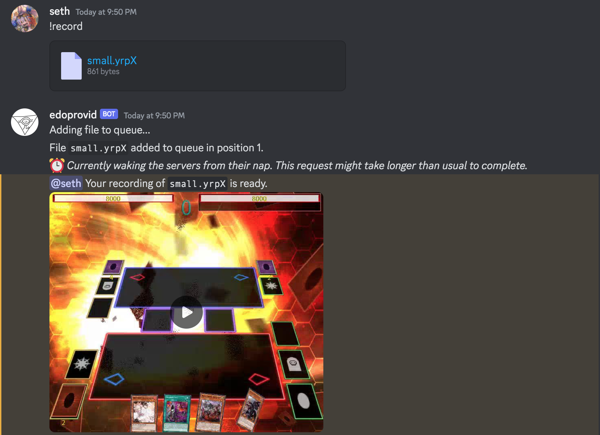

# `!record` command

Takes an EDOPro replay file (.yrpX) and generates a video file (.mp4) showing the actions in the duel.

## Usage

- `!record` with a replay file attached
- `!record` as a reply to a message with a replay file attached

## Current behavior

Returns an mp4 file showing the actions in the duel.
