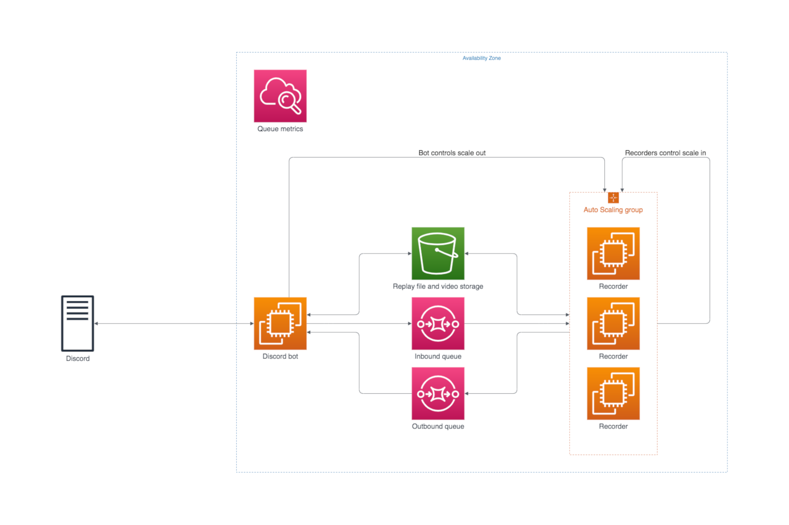
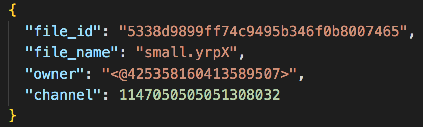
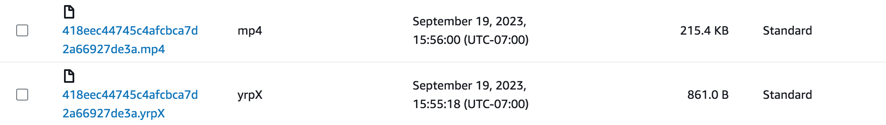

# System architecture

## Overview

EDOProVid has two main parts: the EC2 instance handling all the Discord functionality (referred to as the bot), and the Autoscaling group running EDOPro and recording videos (referred to as the recorders). Shared between them are two queues and an S3 bucket for file storage. The S3 bucket stores both replay files and video files. The queues are used for communication between the bot and the recorders. Every 30 seconds, the bot sends the number of jobs currently being processed and the number of jobs in the inbound queue to CloudWatch.

The inbound queue holds information on jobs that have not yet been started, and the outbound queue holds information on jobs that have been completed successfully or unsuccessfully. When a user initiates a recording, the bot pushes the relevant information onto the inbound queue. A recorder will pop the message off the inbound queue and start working on that job. Once it finishes, that recorder will push the job information onto the outbound queue. The bot polls the outbound queue and sends the relevant file through Discord.

<em>Typical queue message</em>

Every job has an associated file id, which is a UUID generated by the bot. This is the name of the replay file in S3, as well as the name of the video file when the job is finished. The file name, Discord ID of the file owner, and the Discord channel ID are all used to send the completed video file to the correct Discord channel.

<em>Snapshot of the S3 bucket showing the file id</em>

If the replay exceeds ten minutes or the file itself is corrupted, the recorder will time out. The message it sends to the outbound queue will contain everything except the file id, which will be a blank string.

## Scaling

In order to minimize resources while still being able to process multiple jobs in parallel, the recording is handled by an Autoscaling group. scale-outs are initiated by the bot, and scale-ins are initiated by the recorders. The number of instances running at any given time should be at least equal to the number of jobs in the inbound queue, until the maximum number of instances is reached. (This formula is completely arbitrary, by the way.) An instance terminates itself if it is idle for 60 seconds without a new job.

The autoscaling group was originally supposed to be a dynamic autoscaling group - in other words, the autoscaling group would read data from CloudWatch and start/terminate instances accordingly. The desired number of instances in the group would be proportional to the number of messages in the inbound queue. When the number of messages in the queue changes, the autoscaling group would initiate either a scale-out or scale-in event in order to match the desired number of instances. During a scale-out, a new EC2 instance would be added to the group; no problems there. During a scale-in, on the other hand, an EC2 instance would need to be terminated. This poses two problems:

1. The autoscaling group would need to know which EC2 instances are busy. One way to do this would be to have each EC2 instance send a "status" metric to CloudWatch, with the value being one if busy and zero if not busy. CloudWatch metrics have at most a 1-second resolution and can take over a minute to update. This could lead to a scenario where an instance gets terminated while processing a job because the metric does not update fast enough. One way to solve this would be to have the instance stop polling for new jobs after it changes its status to reflect that it is no longer busy.

2. If all the EC2 instances are busy during a scale-in, none of them will be terminated until the next scale-in event. This could lead to a scenario where the inbound queue size drops to zero while the recorders are all busy, a scale-in is initiated, and none of the recorders get terminated. Once they all finish their jobs, the recorders would just sit idly until the next job is received. None of the recorders would terminate until the next scale-in event. Implementing the solution to problem 1 would make this issue worse. The recorders would stop polling for new jobs after finishing all their jobs, thus bricking the system until the queue size increases to the point where a new recorder is added.

## Issues and potential improvements

The most glaring issue with this bot is the fact that it uses SQS improperly. When a recorder reads a job from the inbound queue, it deletes the corresponding message from the queue. This means, if a recorder were to fail somehow and fail to push anything to the outbound queue, the user would not receive a video and would have no idea what happened. A better way of doing this would be to (1) set the message timeout to ten minutes and (2) have the recorder delete the message from the inbound queue _after_ finishing the job.

A malicious user could very easily upload tons of replay files and block the queue for everyone else. The solution would be to limit the number of files a user can have in the queue at any given time. If a user has three jobs in the queue, the bot could prevent the user from uploading another job. This could be implemented using either a database, a dictionary stored in the bot's memory, or a file stored on disk. The in-memory dictionary seems like the best option, since (1) it is the fastest option and (2) it is unlikely that the queue size will ever be long enough to warrant a database or disk storage.

Another way to improve the bot would be to have it determine whether a file will time out before it starts recording. If there were a way to check the replay file's metadata for the estimated length of time, the bot wouldn't have to waste ten minutes on a job that would ultimately fail. Unfortunately, there is no way to determine the exact length of a replay file besides loading it into EDOPro. However, since the file represents a linear sequence of actions, the file size should roughly correlate with the length of the replay. The bot could limit file size to catch files that are very obviously over ten minutes long before the recording process begins, in addition to the time limit during the recording process.
