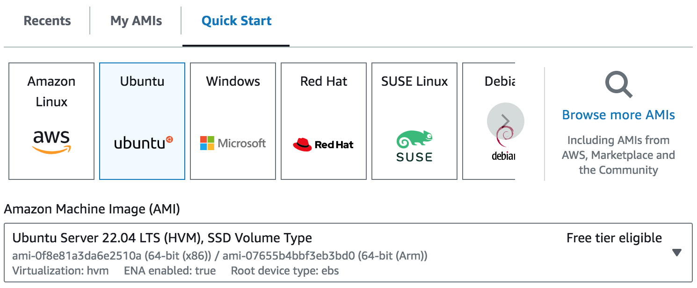

# Bot setup

1. Create an EC2 instance using the quickstart Ubuntu AMI. The OS should be Ubuntu 22.04 LTS. Choose `t2.micro` as the instance type. Create a new key pair if you don't want to use an existing key pair. Use the default settings for everything else.

2.
